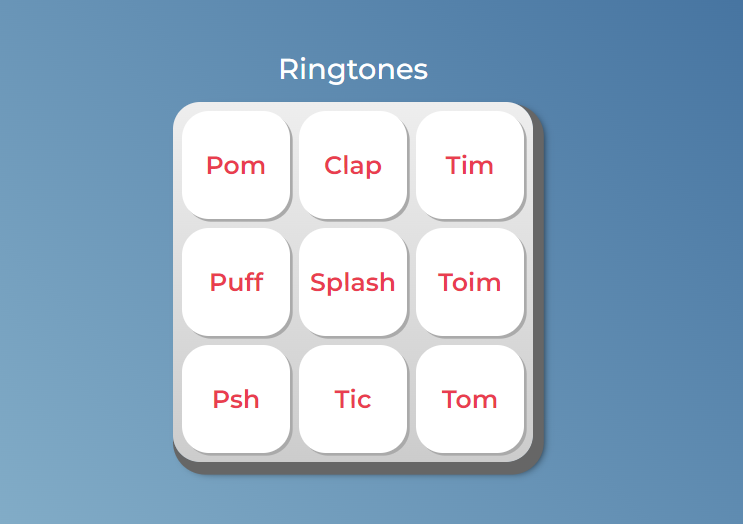

<p align="center">
  
  
  
</p>
<p align="center">
    
</p>

# Ringtones - Interactive Soundboard

Welcome to Ringtones, an interactive soundboard application that allows you to play various sounds by pressing different keys. This project is built to provide a fun and engaging way to explore different sound effects.

## Project Overview

Ringtones is a simple yet entertaining web application where users can press buttons to trigger specific sound effects. Each button corresponds to a different sound, making it an enjoyable way to experiment with audio.

## Features

- **Interactive UI:** A clean and intuitive interface with buttons that trigger different sounds when clicked.
- **Multiple Sounds:** A variety of sounds such as "Pom," "Clap," "Tim," "Puff," "Splash," "Toim," "Psh," "Tic," and "Tom."
- **Responsive Design:** Ensures a smooth experience on both desktop and mobile devices.
- **Engaging Experience:** Instant audio feedback provides an interactive and fun experience for users of all ages.

## Technical Details

- **Language:** HTML, CSS, JavaScript
- **Framework:** No specific framework, just vanilla JavaScript for simplicity and performance.
- **Audio Handling:** Uses the HTML5 `<audio>` element to play sound files.

## How to Use

1. **Clone the Repository:**
   ```bash
   git clone https://github.com/yourusername/ringtones.git
   cd ringtones
   open index.html
